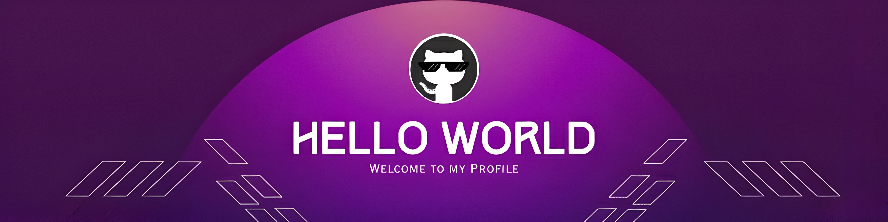

<!--Banner-->

<!--Night Owl image-->

  

<!--Header Name-->
#  Jasur
*Digital Craftsman (Frontend / Full Stack Developer)*
  

<!--Start Intro-->               

  I'm a Full-Stack & Mobile Developer who ships production-ready web and mobile applications —
  from architecture to deployment. My core stack is <b>React.js, Next.js, NestJS, Node.js,
  TypeScript</b> on web, and <b>React Native (Expo)</b> on mobile. I've worked across multiple
  commercial projects, building scalable APIs, cross-platform apps, and clean, performant UIs.

- 🏗️ Full-stack in practice — I own the entire product, from database to UI
- 📱 Shipping real cross-platform apps with **React Native & Expo**
- ⚙️ Backend powered by **NestJS** — clean architecture, scalable REST APIs
- 💡 I build solutions that are fast, maintainable, and actually enjoyable to use
- 🚀 Always exploring — modern patterns, mobile dev, cloud infra, and beyond

<!-- Contribution Graph -->
<h2 align="center">📈 Cᴏɴᴛʀɪʙᴜᴛɪᴏɴ Gʀᴀᴘʜ 📈</h2>

    

---

<!--Dynamic Quote card updates everyday at 12 PM--> 
<h2 align="center">🌟 Tʜᴏᴜɢʜᴛ ᴏғ ᴛʜᴇ Dᴀʏ 🌟</h2>

<!--STARTS_HERE_QUOTE_CARD-->

    

<h2 align="center">🤝 Cᴏɴɴᴇᴄᴛ Wɪᴛʜ Mᴇ 🤝 </h2>

  

</a>

 

<!--Footer--> 

  

